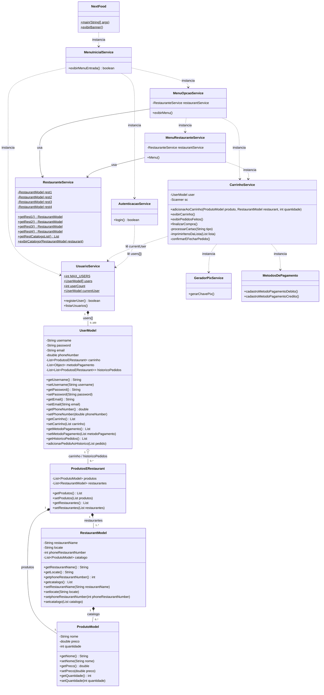

## 🟢 NextFood

Este repositório contém o desenvolvimento do projeto **NextFood**, elaborado como parte da **Avaliação A3** da disciplina de programação. O objetivo é aplicar os conceitos de Programação Orientada a Objetos (POO), Conventional Commits e gerenciamento de dados em memória em um sistema de Delivery via terminal.

## 🛠️ Ferramentas

**Linguagem**

  

**Ferramentas de desenvolvimento**

  
  &nbsp;
  

## 👤 Equipe

| NOME   | RA |
|------------|------|
| Gabriel Teixeira Ricca  | 8261113738 |
| Igor de Souza Bueno  | 8261107854 |
| Ryan Gomes dos Santos  | 8261102012 |
| Daniel Magalhães Pereira Dos Santos  | 8261104325 |
| Gabriel Ramos do Nascimento | 826176212 |
| Arthur Leite da Silva | 826113097 |
| Henrique Alberto Midega | 826195587 |

## Diagrama de Classes

